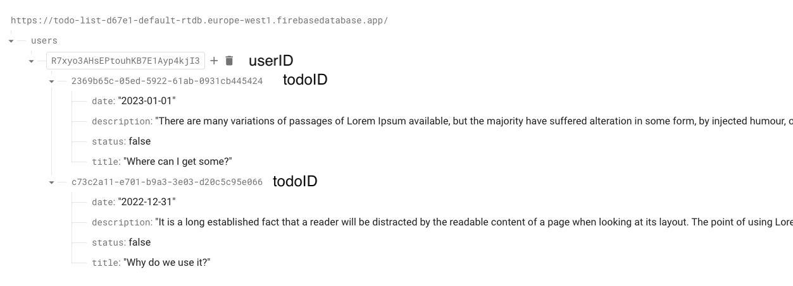

**CLEVER TO-DO LIST**
=====================

## TASK

[doc, click](https://drive.google.com/file/d/19dZ_JWMortgNqL-JT4N6BkYIo7ioi_uW/view?usp=sharing)
## HOW TO RUN THE APP

```
npm start
```
Runs the app in the development mode.\
Open [http://localhost:3000](http://localhost:3000) to view it in your browser.

**env** \
.env template:
```
REACT_APP_FIREBASE_APIKEY = "your api key here.."
REACT_APP_FIREBASE_AUTHDOMAIN = "..."
REACT_APP_FIREBASE_PROJECTID = "..."
REACT_APP_FIREBASE_STORAGEBUCKET = "..."
REACT_APP_FIREBASE_MESSAGINGSENDERID = "..."
REACT_APP_FIREBASE_APPID = "..."
REACT_APP_FIREBASE_DATABASEURL = "..."

```

## DATABASE SNAPSHOT


## APPLICATION STACK
```
react(18.2.0)
firebase(9.15.0)
moment(2.29.4)
tailwindcss(3.2.4)
react-firebase-hooks(5.1.1)
react-hot-toast(2.4.0)
react-icons(4.7.1)
react-router-dom(6.4.5)
react-uuid(2.0.0)
```

## COMPONENTS

In general directory you can see the next files and directories:
```
/src                  all project components
    /components       
    App.js 
    firebase.json
    index.css
    index.js
package.json          package.json file
README.md             this file
tailwind.config.js    tailwind config
.gitignore            git ignore
```

## AUTHOR

[Amaev Artem](https://github.com/aamaev)
